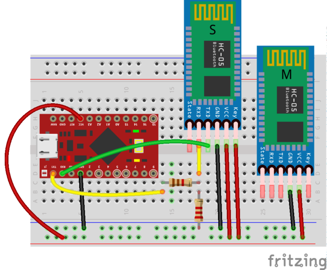
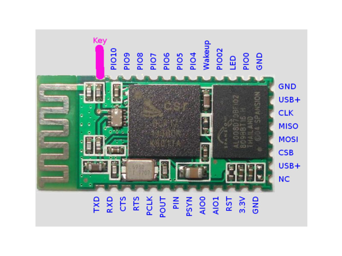

KinderBot
=====

Contains design files and code for my version of the Primo robotic platform for young kids www.primo.io licenced under CC by-nc-sa 4.0 International
## Components
### Board
   - laser cut xxx and yyy in 3mm ply or bamboo
   - laser cut zzz in 1.5mm clear acrylic
   - 3d print 4 off zzz
   - 1 colorsense PCB
   - Arduino mega
   - HC05 serial bluetooth module
   - 16 rgb leds
   - 16 red leds

### Robot
   - Kinder surprise egg
   - laser cut zzz of 3mm ply
   - Arduino pro micro 
   - 2 gear motors 3-6V with tyres
   - HC05 serial bluetooth module
   - H-Bridge IC (sn75441one)
   - 1.1K resistor
   - 1.2K resistor
   - 2 12pin female header
   - 2 2pin male header
   - Battery holder for 4xAA

## Pairing Bluetooth modules
Once you have all your components ready, the first step set up the two HC-05 bluetooth modules to automatically pair with one another when they are turned on. We do this now as it is easier to setup and debug with both Arduinos handy than when they are plugged into the board/robot. We will configure the module for the board as the master and the module for the robot as the slave. 

   1) Get a permanent marker and write S for slave on one module and M for master on the other. Do it now, trust me, otherwise you will configure them and then forget which is which.
   2) Using the Arduino pro-micro for your bot, construct the circuit below on a breadboard.

Note that different manufacturers of the HC-05 breakout boards have used slightly different variants of pin orderings. On my board they `key` pin is not broken out. To temporally pull it high while programming the chip in AT mode I have just wedged a jumper wire under the protective plastic coating. Alternatively you can solder a wire directly to the pad on the bluetooth chip (see image below).

   3) Load the [bluetooth setup script](/code/bluetooth/bluetoothSetup/bluetoothSetup.ino) onto the arduino and open the serial monitor. If all goes well you should get an output like this:
   
   4) Copy the address of the slave into a text editor and replace all : with ,
   
   5) Unplug the arduino and swap the position of the master and slave modules. Edit the bluetooth setup script to setup the master module and re-upload the script to the arduino. Again if all goes well you should see ...
   
### Debugging
The bluetooth modules are setup by first putting them in AT mode and then sending AT commands to configure them. The script simply sends AT commands from the Arduino to the bluetooth module. If the steps above did not work ...
   1) Check if the module is in AT mode. If the module being configured (the one closest to the breadboard) is sucessfully in AT mode it should be flashing slowly ~ once per second when powered. If both modules are flashing rapidly, double check the wiring to the key pin. Ensure that the key pin is connected before you power up the module. 
   2) If the module is flashing slowly but you get nothing back from the AT commands check that RX/TX are wired correctly. TX0 on the arduino should be connected to RX on the bluetooth and RX0 on the arduino to TX on the bluetooth module.
   3) If the module is flashing slowly but you get garbage printed in the serial monitor, check that you serial termial baud rate is set to 9600 and line ending to NL & CR.
   4) If the module is flashing slowly but some AT command errors try running the script again. If that fails you may have to experiment with a different sequence of AT commands see xxx for an explaination of AT codes. 
   

## Assembly

### Board

### Robot

## Programming & Calibration

### Board

### Robot

We now need to  

